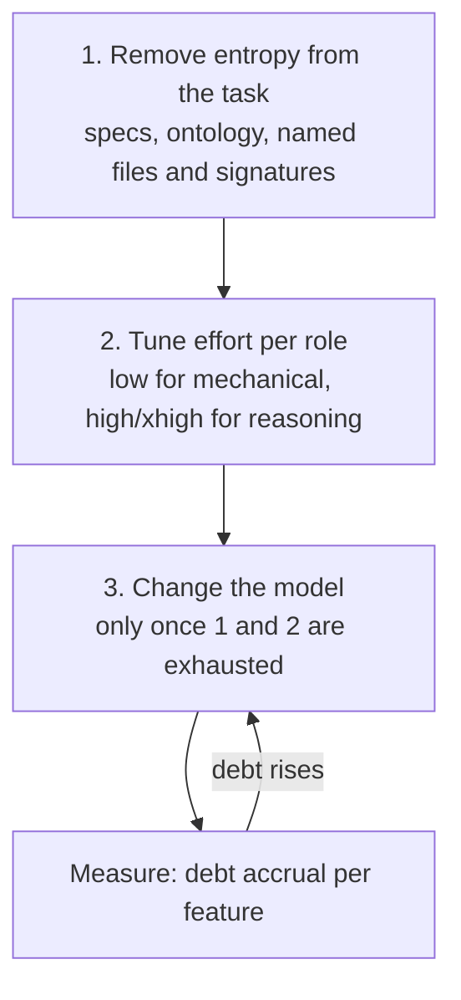

# Model Strategy — Mixing Models Without Losing Quality

> Which model each agent runs on, why, and how to know when the mix is wrong.
> Prices verified 2026-09-06. Re-verify before acting on them; they move.

---

## 1. Start With the Real Numbers

| Model | ID | Context | Input $/1M | Output $/1M |
|---|---|---|---|---|
| Claude Opus 5 | `claude-opus-5` | 1M | $5.00 | $25.00 |
| Claude Sonnet 5 | `claude-sonnet-5` | 1M | $2.00 | $10.00 |
| Claude Haiku 4.5 | `claude-haiku-4-5` | **200K** | $1.00 | $5.00 |

The ratio is **5 : 2 : 1**, identical on input and output.

Two consequences that contradict the usual intuition:

- **Opus is 2.5x Sonnet, not 5x.** Downgrading the agent that does your hardest
  thinking buys a 60% discount on that agent alone — rarely the best trade
  available.
- **Haiku saves only 50% over Sonnet and has one-fifth the context.** For a
  file-reading agent, 200K is a real ceiling, not a footnote. Haiku is a
  narrow-scope tool, not a general discount.

**Output costs 5x input.** So spend is dominated by whichever agent *writes the
most*, not by whichever *reads the most*. In this harness that is the
implementer — which is also the agent you can least afford to make careless.
That tension is the whole problem.

---

## 2. The Lever Order (Do Not Skip Ahead)

Model choice is the **third** lever, not the first. Reaching for it first is how
people cut cost by 30% and quality by 60%.



**Lever 1 — remove entropy.** A cheaper model is not a dumber model on an easier
task. If `tasks.md` names the file, the signature, and the covered `R<n>`, the
implementer is transcribing a decision, not making one — and Sonnet is genuinely
sufficient. This is what the ontology work in `ontology_overview.md` buys you:
every deterministic decision moved out of the LLM lowers the intelligence floor
the whole pipeline needs.

**Lever 2 — effort.** On Opus 5 and Sonnet 5, `output_config.effort` runs `low`
through `max`. Lower effort on a strong model frequently beats high effort on a
weaker one, and it keeps you on one model. Two caveats specific to this harness:
Haiku 4.5 does not accept `effort` at all, and **Claude Code subagent frontmatter
exposes `model:` but not `effort:`** — so inside this repo, lever 2 is only
available if you drive the API directly. Inside Claude Code, lever 3 is the lever
you actually have.

**Lever 3 — the model mix.** Below.

---

## 3. Pin One Model Per Role

Prompt caches are **model-scoped**. A role that re-reads `AGENTS.md`, `docs/`,
and the spec on every invocation builds a cacheable prefix — but only while that
role stays on one model. Flipping a role between models by feature complexity
halves that role's hit rate and can cost more than the downgrade saves.

**Rule: the model is a property of the role, not of the task.**

Escalation (§5) deliberately breaks this. That is a trade you make knowingly,
when rework is the alternative — not a free switch.

---

## 4. Role Assignment

### Current baseline (deployed 2026-09-06)

**All four agents run `model: sonnet`.** This is a deliberate interim state, not
the target assignment below.

A uniform baseline is what §6 requires before any of this can be measured: you
cannot attribute a change in debt accrual to a model swap if several roles moved
at once, and you have no reference point if they never shared one. Run features
on the flat configuration, record the accrual rate, then change one role.

It also keeps the `reviewer >= implementer` guard intact — equal satisfies it.
The target table below is the destination, not the current repo state.

| Agent | Model | Why |
|---|---|---|
| `leader` | **Opus** | Decomposition errors propagate into every downstream agent. Its context is kept thin by the anti-broken-telephone rule (subagents return file references, not content), so it is cheaper to run than it looks. |
| `spec_author` | **Opus** | Highest ROI per token in the pipeline. A spec is a few thousand tokens; an error in it is paid three times — implementation, review, rework — at the *expensive* model. Never economize here. |
| `implementer` | **Sonnet** | Executes an approved `tasks.md`: files named, signatures decided, alternatives already discarded. Low entropy by construction. It is also the dominant cost center (output-heavy), so this is where the 60% actually lands. Conditional on the spec being good — see §5. |
| `reviewer` | **Sonnet** | Traceability and checkbox completion are mechanical (and should migrate to the ontology validator). What remains is judging whether a test is *meaningful*. Never below the implementer — see the rule below. |
| explorers | **Haiku** | High read volume, low reasoning, returns a summary. Watch the 200K ceiling: an explorer sweeping a large repo will hit it. Scope each explorer to a narrow question. |

### The rule that protects quality

> **`reviewer` >= `implementer`, always.**

A reviewer weaker than the agent it audits does not review — it rubber-stamps.
It will not catch the shortcut, so the shortcut never reaches
`techdebt_list.json`, so your debt ledger reads clean while the codebase rots.
This is the single worst trade available in a multi-agent harness, and it is also
the most tempting, because the reviewer looks like a cheap formality.

If you escalate the implementer to Opus, the reviewer escalates with it.

---

## 5. Escalation Tripwires

Rework is the most expensive token in the system: it pays for the same work two
or three times, usually at the higher tier anyway. Escalate when these fire:

| Trigger | Action |
|---|---|
| Reviewer rejects the same feature twice | Implementer -> Opus (and reviewer with it) |
| Feature is `Complex (refactor)` in the leader's effort table | Implementer -> Opus from the start |
| Feature touches a security, persistence, or migration boundary | Implementer -> Opus; no exceptions |
| A `critical` debt is being paid | Implementer -> Opus |
| `spec_author` returns `blocked` twice on the same feature | The feature is under-specified — fix `acceptance` in `feature_list.json`, do not escalate |

Note the last row. When the same agent fails repeatedly, a bigger model is
usually the wrong answer; the input is bad. Escalating there buys a more
expensive, more confident wrong answer.

---

## 6. Knowing Whether the Mix Is Too Cheap

This is the part most model-mixing strategies leave out, and without it the
whole thing is faith.

**`techdebt_list.json` is the instrument.** Because the implementer must declare
every shortcut, and the reviewer rejects undeclared ones, the ledger measures
something real: how often the cheap model chose the cheap path.

The loop:

1. Record the baseline — debt entries opened per feature, and their severity mix.
2. Change exactly one role's model.
3. Run three or four features.
4. Compare. **Debt accrual rising is the signal to revert**, regardless of how
   good the token savings look.

Cost per *completed feature* is the honest metric — not cost per request. A
cheaper implementer that triggers one extra review cycle is not cheaper.

---

## 7. What Not To Do

- ❌ **Downgrade the reviewer to save money.** You stop finding problems. The
  metrics improve because the detector broke.
- ❌ **Downgrade `spec_author`.** The error multiplies downstream at the
  expensive tier. This is the cheapest quality you will ever buy.
- ❌ **Run explorers on Opus.** Highest volume, lowest reasoning — the exact
  inverse of where the premium belongs.
- ❌ **Swap models per feature.** Forfeits that role's prompt cache (§3).
- ❌ **Judge the mix by token spend alone.** Without §6 you are measuring cost
  while quality moves silently.

---

## 8. Applying It

Claude Code subagents take the model in frontmatter:

```yaml
---
name: implementer
description: ...
tools: Read, Write, Edit, Glob, Grep, Bash
model: sonnet
---
```

Accepted values are `opus`, `sonnet`, `haiku`. Omitting the field inherits the
session's model. All four agents in `.claude/agents/` currently carry an explicit
`model: sonnet`; moving to the §4 target means editing those files one at a time.

Change one role at a time and run §6 between changes. Changing all four at once
tells you nothing about which change caused what.
