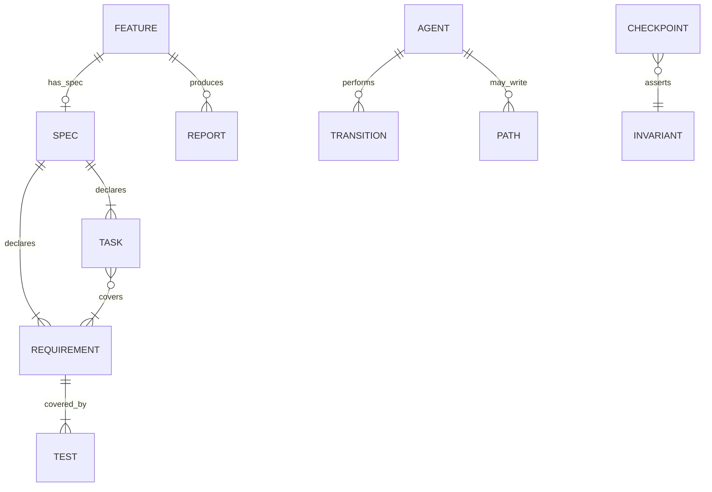
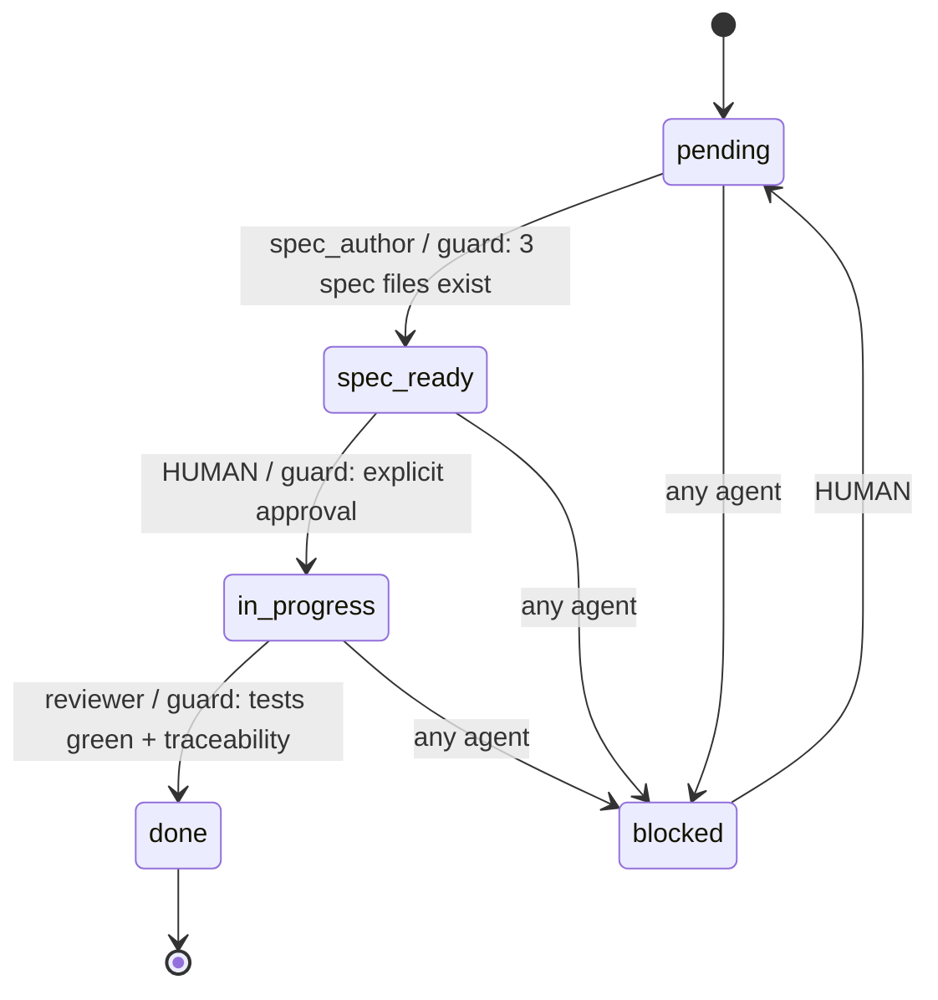
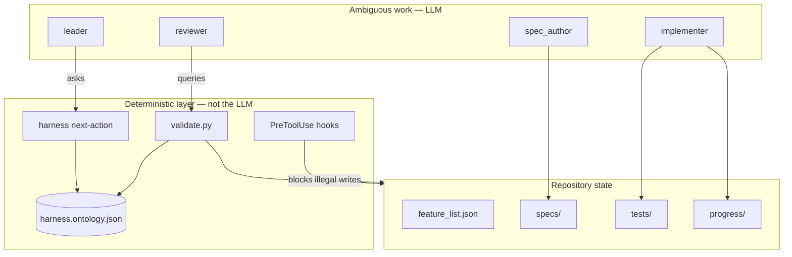
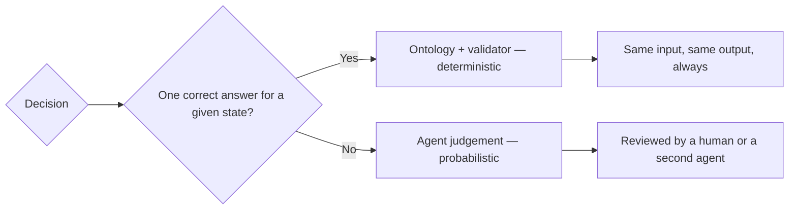

# Ontology Overview — Deterministic Decisions in the Harness

> **Status:** design note. Nothing has been implemented yet.
> **Purpose:** capture why this harness needs an ontology layer, what it should
> cover, and which implementation option was chosen — so the reasoning survives
> the session that produced it.

---

## 1. The Problem

This harness coordinates four agents (`leader`, `spec_author`, `implementer`,
`reviewer`) through a lifecycle encoded entirely in **prose**: `AGENTS.md`,
`docs/specs.md`, `docs/verification.md`, `CHECKPOINTS.md` and the agent
definitions in `.claude/agents/`.

Prose is re-interpreted on every turn. That is acceptable for genuinely
ambiguous work (designing a solution, writing a test). It is **not** acceptable
for decisions that must always produce the same answer:

- Which state transition is legal right now.
- Which agent is allowed to write which path.
- Whether a feature satisfies the closing criteria.

Empirically, these decisions drift. The trigger for this work was observing that
the same repository state produced different agent conclusions across runs.

### Symptom already present in the repo

The state machine is written **three times**, in three files, in three slightly
different phrasings:

| File | Form |
|---|---|
| `AGENTS.md` §4 | ASCII flow + numbered narrative |
| `docs/specs.md` | state table + ASCII flow |
| `.claude/agents/leader.md` | bulleted per-state instructions |

Three copies of one rule is drift waiting to happen. Whichever copy an agent
happens to read wins.

---

## 2. The Core Distinction

The single most important idea from this analysis:

> **An ontology does not give you determinism. A rule layer evaluated OUTSIDE
> the model does.**

Two separate concerns get conflated under the word "ontology":

| Concern | Answers | Example in this harness |
|---|---|---|
| **Ontology** — vocabulary, entities, relations | *"What exists and how is it connected?"* | `Feature` has_spec `Spec`; `Requirement` covered_by `Test` |
| **Rule / policy layer** — transitions, preconditions, invariants | *"Which action is legal right now?"* | `spec_ready → in_progress` requires human approval |

An ontology the agent merely *reads* as Markdown is still prose, and prose is
still probabilistic. Determinism arrives only when a validator, a CLI, or a hook
— something that is not the LLM — evaluates the rules.

**Practical consequence:** the ontology is the *data*; the enforcement is the
*value*. Shipping the first without the second produces documentation, not
determinism.

---

## 3. What Is Actually Deterministic Here

Everything in this table has exactly one correct answer for a given repository
state. None of it should depend on model sampling.

| Decision | Currently lives in | Should become |
|---|---|---|
| Valid states and legal transitions | `AGENTS.md` §4, `docs/specs.md`, `leader.md` (3 copies) | state machine |
| Which agent may write which path | `CLAUDE.md`, `leader.md` (prose) | permission matrix |
| Required artifacts per state | `docs/specs.md` + `CHECKPOINTS.md` | transition preconditions |
| `R<n>` ↔ test traceability | `docs/verification.md`, `reviewer.md`, C6 | `covered_by` relation |
| Reviewer verdict (C1–C6) | model judgement | query over the graph |
| Effort scaling by complexity | `leader.md` table | decision table |

What stays with the LLM: writing requirements, choosing a design, implementing
code, judging whether a test is *meaningful*. That is the correct division of
labour — the model does the ambiguous part, the ontology does the mechanical
part.

---

## 4. Options Considered

### A. Documentation-only ontology
`docs/ontology.md` with vocabulary and tables. Agents read it.

- **Pros:** near-zero cost; consolidates the triplicated state machine.
- **Cons:** **does not deliver determinism.** Still interpretation.
- **Verdict:** useful only as a stepping stone toward B.

### B. Declarative ontology + validator
`ontology/harness.ontology.json` (entities, states, transitions, relations,
invariants) plus `ontology/validate.py` (standard library only) wired into
`init.sh`.

- **Pros:** single source of truth; executable; honours the "no external
  dependencies" rule in `docs/architecture.md`. The model stops deciding and
  starts querying.
- **Cons:** the schema must be kept as the *only* source — see §8.
- **Verdict:** the core.

### C. Formal ontology (RDF/OWL + SHACL, or Datalog)
Real semantic reasoning, inference, shape validation.

- **Pros:** maximum rigour; buys *inference* (deriving inconsistency without
  writing the rule explicitly).
- **Cons:** breaks the no-external-dependencies constraint; heavy conceptual
  load for 4 agents and 5 states.
- **Verdict:** deferred. Justifiable only if reasoning across projects becomes
  a requirement.

### D. Executable ontology as an oracle
B, plus a CLI (`./harness next-action`) and `PreToolUse` hooks.

- **Pros:** the agent does not *reason* about the transition — it **asks**, and
  receives exactly one legal action. Hooks make illegal writes physically
  impossible rather than merely forbidden.
- **Cons:** more moving parts; hooks are Claude Code specific.
- **Verdict:** the enforcement layer.

---

## 5. Decision

**B as the core, D as the enforcement layer, delivered in phases. C deferred.**

Rationale: B collapses six places of prose into one datum; D turns that datum
into a constraint the model cannot disobey even when it hallucinates. Without D,
B is attractive documentation.

---

## 6. Proposed Shape

### Entities and relations

### Lifecycle as a state machine

The one authoritative copy. Every other file references it instead of restating
it.

Each transition carries: **actor**, **guard** (precondition), and **effect**
(artifacts that must exist afterwards).

### Where the layer sits

### Who decides what

### Invariants worth encoding first

- At most one feature in `in_progress` (today: checkpoint C2).
- Every `done` feature has all tasks `[x]` (C6).
- Every `R<n>` has at least one covering test (C6, `docs/verification.md`).
- Every feature past `pending` with `sdd: true` has all three spec files (C6).
- `leader` never writes `src/**` or `tests/**` (`CLAUDE.md` hard rule).

---

## 7. Expected Benefits

1. **Drift eliminated.** The state machine stops existing in three phrasings.
2. **Deterministic reviewer verdict.** C1–C6 moves from *"the judge has an
   opinion"* to *"the query returns a boolean"*. Same diff, same verdict, always.
3. **Cheaper pipeline.** The mechanical checks (traceability, states, checkbox
   completion) leave the expensive model and become a script.
4. **Fail early, fail cheap.** A `spec_ready` missing its three files fails in
   `init.sh`, not forty minutes later during review.
5. **Auditability.** Every decision maps to a *named rule*, not a paragraph. You
   can explain *why* the harness did what it did.
6. **Docs become derived, not duplicated.** `CHECKPOINTS.md` can be generated
   from the invariants rather than maintained alongside them.

---

## 8. Risks and Anti-patterns

- ❌ **Two sources of truth.** If the ontology is maintained *in parallel* with
  the prose instead of *replacing* it, the result is worse than today: two
  authorities that disagree. Prose files must reference the ontology, not
  restate it.
- ❌ **Ontology without enforcement.** Option A alone feels like progress and
  delivers none.
- ❌ **Modelling the world.** The scope is harness decisions, not a universal
  taxonomy. Every entity added must back a rule that actually runs.
- ❌ **Reaching for OWL early.** Inference is not the bottleneck; consistency is.

---

## 9. Open Questions

- **Scope:** does the ontology cover only the harness lifecycle (states,
  permissions, artifacts, traceability), or also the domain of the application
  built on top of it? *(asked, not yet answered)*
- Should `CHECKPOINTS.md` be generated from the invariants, or kept hand-written
  and validated against them?
- Do the `PreToolUse` hooks belong in this repo, or in the consuming project's
  `.claude/settings.json`?
